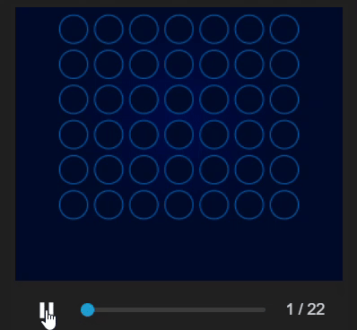

# 🎮 Connect Four AI using RNN and Proximal Policy Optimization (PPO)

This project demonstrates how to train a Recurrent Neural Network (RNN) agent to play the game of Connect Four using the PPO (Proximal Policy Optimization) reinforcement learning algorithm.

---

## 🕹️ Demo



---

## 🧠 Project Overview

Connect Four is a classic two-player strategy game. In this project, we model it as a reinforcement learning environment and train an intelligent agent using:

- **RNN-based Policy Network** to handle sequential board state dynamics
- **PPO Algorithm** to optimize actions with stability and performance
- **Custom Connect4 Gym Environment** tailored for training the agent

---

## 📦 Features

- Implements PPO with RNN for temporal action awareness
- Trains the model through self-play episodes
- Tracks and plots rewards over time
- Validates learned policy through simulation

---

## 🧱 Technologies Used

- Python
- PyTorch
- OpenAI Gym (custom environment)
- NumPy
- Matplotlib

---

## 🚀 How to Run

### 1. Install dependencies

```bash
pip install torch gym matplotlib numpy
